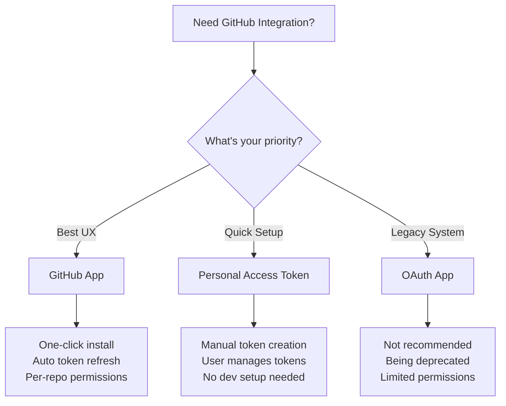

# GitHub Integration Methods Comparison

## Quick Decision Guide



## Detailed Comparison

| Feature | GitHub App | Personal Access Token | OAuth App |
|---------|------------|----------------------|-----------|
| **Setup Complexity** | Medium (one-time) | Low | Medium |
| **User Experience** | ⭐⭐⭐⭐⭐ Excellent | ⭐⭐⭐ Good | ⭐⭐⭐⭐ Good |
| **Developer Setup** | Create GitHub App | None | Create OAuth App |
| **User Setup** | Click "Install" | Create & paste token | Click "Authorize" |
| **Token Management** | Automatic | Manual | Automatic |
| **Permissions** | Fine-grained (per-repo) | User-defined | All-or-nothing |
| **Rate Limits** | 5,000/hour per install | 5,000/hour (user's limit) | 5,000/hour (shared) |
| **Token Expiry** | Auto-refresh | User manages | Auto-refresh |
| **Security** | ⭐⭐⭐⭐⭐ Best | ⭐⭐⭐⭐ Good | ⭐⭐⭐ OK |
| **Future-proof** | ✅ Recommended by GitHub | ✅ Always supported | ❌ Being phased out |

## User Flow Comparison

### GitHub App Flow (Best UX)
```
User clicks "Connect" 
    → Redirected to GitHub
    → Selects repositories
    → Clicks "Install"
    → Done! ✨
```
**Time: ~30 seconds**

### Personal Access Token Flow (Current)
```
User clicks "Connect"
    → Instructions shown
    → Opens GitHub settings
    → Creates new token
    → Selects permissions
    → Copies token
    → Pastes in our app
    → Done!
```
**Time: ~2-3 minutes**

### OAuth App Flow (Legacy)
```
User clicks "Login with GitHub"
    → Redirected to GitHub
    → Reviews permissions (all repos)
    → Clicks "Authorize"
    → Done!
```
**Time: ~30 seconds** (but less secure)

## Implementation Effort

### GitHub App
```javascript
// One-time setup: Create GitHub App
// Then in code:
app.get('/connect-github', (req, res) => {
  res.redirect(`https://github.com/apps/${APP_NAME}/installations/new`)
})

app.get('/github-callback', async (req, res) => {
  const { installation_id } = req.query
  // GitHub App is installed! Auto-managed tokens
})
```

### Personal Access Token
```javascript
// No setup needed!
app.post('/connect-github', async (req, res) => {
  const { token } = req.body
  const octokit = new Octokit({ auth: token })
  
  // Validate token
  const { data: user } = await octokit.users.getAuthenticated()
  // Store encrypted token
})
```

## Recommendations

### For Production SaaS Apps
**Use GitHub Apps** - The best user experience and security
- Users expect one-click integrations
- Fine-grained permissions build trust
- Higher rate limits support growth

### For MVP/Prototypes
**Use Personal Access Tokens** - Get to market faster
- Zero infrastructure setup
- Users understand the process
- Easy to implement and test

### For Enterprise/Legacy
**Consider OAuth Apps** - If you must
- Familiar to enterprise users
- But plan to migrate to GitHub Apps
- Document the security limitations

## Migration Path

```
Personal Access Tokens (MVP)
    ↓
Add GitHub App option (Growth)
    ↓
Deprecate tokens (Maturity)
    ↓
GitHub App only (Scale)
```

This allows you to start simple and evolve based on user needs!